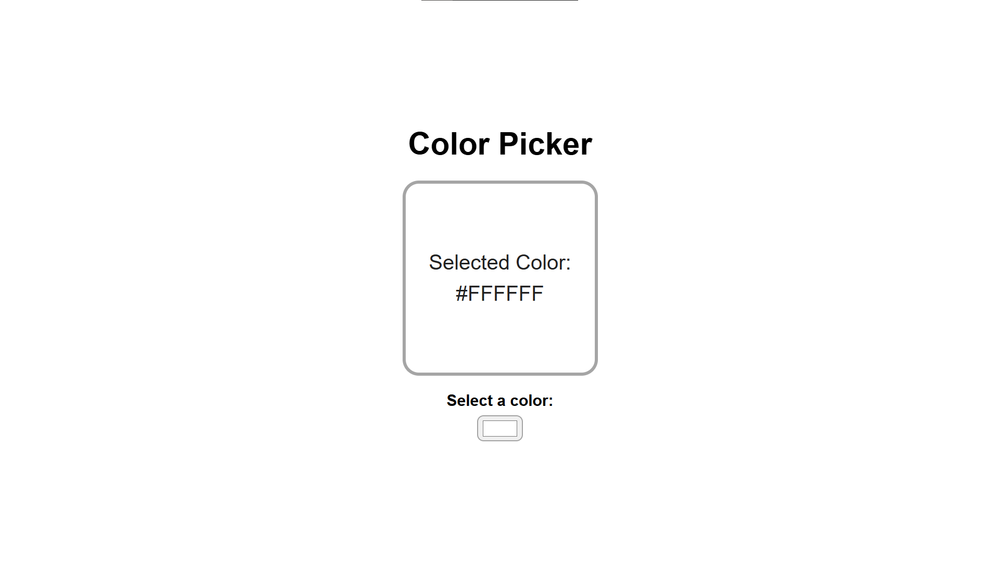
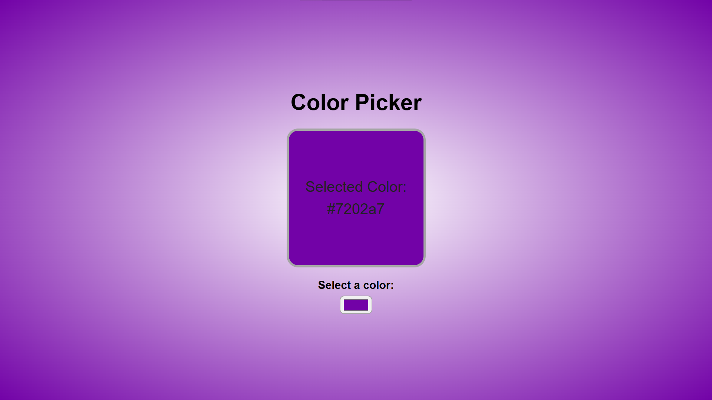

# 🎨 Color Picker

  
  

Seletor de cores que fornece o código hexadecimal da cor escolhida.

---
## 🕹️ **Demonstração**

👉 [Clique aqui](https://italoalulas.github.io/color-picker/)

---
## ⚙️ **Funcionalidades**

- 🎨 Fornece o código hexadecimal de qualquer cor escolhida pelo usuário (ex: Branco = #FFFFFF)
- 🎨 O plano de fundo adquire a cor escolhida pelo usuário.

---
## 🧠 **Aprendizados**

- Uso do hook useState do React.
- Manipulação de evento com onChange.
